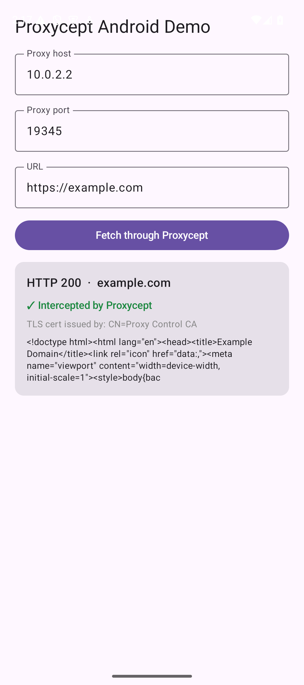

# Proxycept client samples

Official sample apps showing how to point a client at a **[Proxycept](https://proxycept.com)**
proxy to **capture, intercept, and mock** its HTTP(S) traffic.

Each sample makes an HTTPS request through the proxy and proves it was intercepted by
displaying the **TLS issuer** of the server certificate — when traffic flows through Proxycept,
the leaf certificate for e.g. `example.com` is signed by **`Proxy Control CA`** (the proxy's CA)
rather than the real one. The same request shows up live in the Proxycept web app under
**Sessions**.

| Sample | Stack | Proof |
|--------|-------|-------|
| [`ios/`](ios) | SwiftUI · `URLSession` + `connectionProxyDictionary` |  |
| [`android/`](android) | Kotlin + Compose · `HttpsURLConnection` + `Proxy` |  |

## The three things every client needs

1. **Point at the proxy.** Configure your HTTP(S) proxy to the profile's host:port (from the
   profile's *Connection* tab in the Proxycept app).
   - iOS Simulator: `127.0.0.1` is the host Mac's loopback.
   - Android emulator: the host is **`10.0.2.2`** (not `127.0.0.1`).
   - Real devices: the host's LAN IP, or the public edge host on `:8443` (with per-profile auth).
2. **Trust the CA.** HTTPS is decrypted by the proxy, so the client must trust the Proxycept
   CA (download it from the profile's *Connection* / Settings → HTTPS/CA).
   - iOS: install the `.mobileconfig`, or `xcrun simctl keychain <udid> add-root-cert ca.pem`.
   - Android: bundle it via `network_security_config`, or install it in device settings.
3. **Make requests.** They'll be captured (and can be intercepted/modified or mocked) by Proxycept.

## Run a sample

See [`ios/README.md`](ios/README.md) and [`android/README.md`](android/README.md). Each ships a
`build-and-run.sh` that builds, trusts the CA, installs, and launches on a Simulator/emulator.

---

Proxycept is a hosted HTTP(S) proxy platform for QA/devs — shared proxy, traffic capture,
on-the-fly intercept/edit, profile-based rules, OpenAPI/Postman mocks, and fault injection.
Learn more at **[proxycept.com](https://proxycept.com)** · docs at **[proxycept.com/docs](https://proxycept.com/docs)**.
