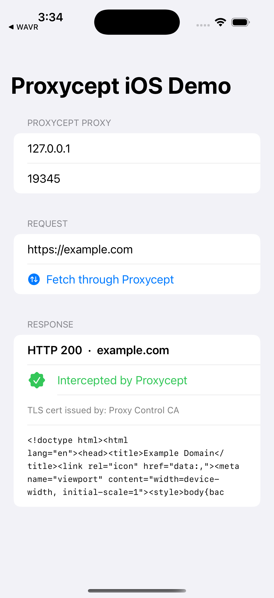

# Proxycept iOS Demo (SwiftUI)

A minimal SwiftUI sample app that routes its HTTPS traffic through a **Proxycept** proxy and
proves the request was intercepted — it shows the response status, the captured body, and the
**TLS issuer** of the server certificate. When traffic is intercepted, the leaf certificate for
e.g. `example.com` is signed by **"Proxy Control CA"** (Proxycept's CA) instead of the real one.



> The same request appears live in the Proxycept web app under **Sessions** as
> `GET 200 example.com/`.

## How it works

`URLSession` is configured with a `connectionProxyDictionary` pointing at the proxy. HTTPS is
tunneled to the proxy via `CONNECT`; the proxy terminates TLS with a cert minted by its CA, so
the app must **trust the Proxycept CA** (installed as a root in the Simulator below). The app's
`URLSessionDelegate` reads the server cert chain during the TLS handshake to display the issuer
— that's the interception proof.

```swift
let config = URLSessionConfiguration.ephemeral
config.connectionProxyDictionary = [
    kCFNetworkProxiesHTTPEnable as String: 1,
    kCFNetworkProxiesHTTPProxy   as String: host,
    kCFNetworkProxiesHTTPPort    as String: port,
    "HTTPSEnable": 1, "HTTPSProxy": host, "HTTPSPort": port,   // iOS has no kCF* HTTPS keys
]
```

## Prerequisites

- macOS + Xcode, plus **xcodegen** (`brew install xcodegen`).
- A booted iOS Simulator (`xcrun simctl boot "iPhone 16 Pro"` then `open -a Simulator`).
- A running Proxycept with a **started proxy profile**. Grab the proxy **host:port** and the
  **CA certificate** from the profile's *Connection* tab (or `POST /api/profiles/{id}/start`
  and `GET /api/ca/certificate?format=pem`). `127.0.0.1` inside the Simulator is the host Mac's
  loopback, so a locally-running proxy worker is reachable.

## Run it

```bash
# from examples/ios-demo
PROXY_HOST=127.0.0.1 PROXY_PORT=19345 CA_PEM=/path/to/proxycept-ca.pem ./build-and-run.sh
```

The script: generates the Xcode project, builds for the booted Simulator, **trusts the CA**
(`simctl keychain <udid> add-root-cert`), installs, and launches. The app fires the request on
launch. Set the proxy host/port in the app's fields (defaults are `127.0.0.1:19345`) or edit
`kDefaultProxyPort` in `ProxyceptDemo/ProxyceptDemoApp.swift`.

## Files

- `ProxyceptDemo/ProxyceptDemoApp.swift` — the whole app (UI + proxied `URLSession` + TLS-issuer probe).
- `project.yml` — xcodegen project definition.
- `build-and-run.sh` — generate → build → trust CA → install → launch on the booted Simulator.
